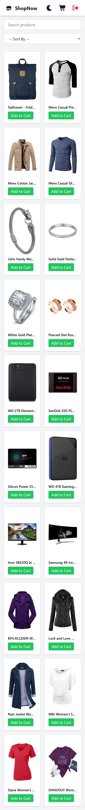

#Products Gallery Web Application

## Overview

A modern, responsive e-commerce web application built with Angular 18 and Tailwind CSS. The app allows users to browse products, view detailed info, filter/sort items, and manage their cart – all powered by the Fake Store API.

---

## Screenshots





---

## Demo Link

[Product Gallery Web Application Demo Link(https://product-gallery-shopnow.netlify.app/login)]

## Tech Stack

- **Framework:** Angular 18 (Standalone Components)
- **Styling:** Tailwind CSS, SCSS
- **Icons:** FontAwesome
- **State Management:** LocalStorage
- **API:** [Fake Store API](https://fakestoreapi.com/)
- **Tooling:** PostCSS, TypeScript

---

## Features

### Products Page

- Fetches products from Fake Store API
- Search by product name (case-insensitive)
- Sort by:
  - Price: Low → High / High → Low
  - Name: A → Z
- Responsive product grid layout
- Loading spinner and error handling

### Product Details

- Dynamic route: `/products/:id`
- Display full info (title, image, category, price, rating, description)
- Add to cart

### Cart Management

- Increase/decrease quantity
- Remove items
- Checkout (dummy)
- Total price calculation
- Empty cart state

### Dark Mode

- Light/Dark theme toggle
- Saved preference in `localStorage`
- Applied globally across all pages

## 🚀 Getting Started

To run the project locally:

```bash
git clone https://github.com/AmlAli66/Products-Gallery.git
cd Products-Gallery
npm install
npm start
```

## 📬 Contact

Developed by [Aml Ali](https://github.com/AmlAli66)
